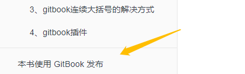
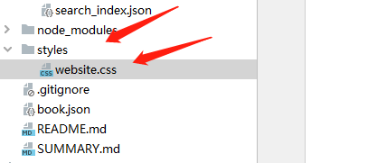

# 3 美化

#### 3.1去掉“本书由Gitbook”



3.1.1 在根目录下新建`styles`文件夹，在里面新建`website.css`文件。



##### 3.1.2 `website.css`文件内容如下：

```
.gitbook-link {
     display: none !important;
}
```

###### 3.1.3 在`book.json`中添加下面的内容。

这个 `styles`节点在`book.json`中和`"plugins"`平级。

```
"styles": {
     "website": "styles/website.css"
 }
```
##### 3.1.4 如果没有`book.json`,可自行生成文件

之后生成的书就没有“本书由Gitbook”字样了。

#### 3.2 除去列表Introduction项

将首项设为`README.md`


